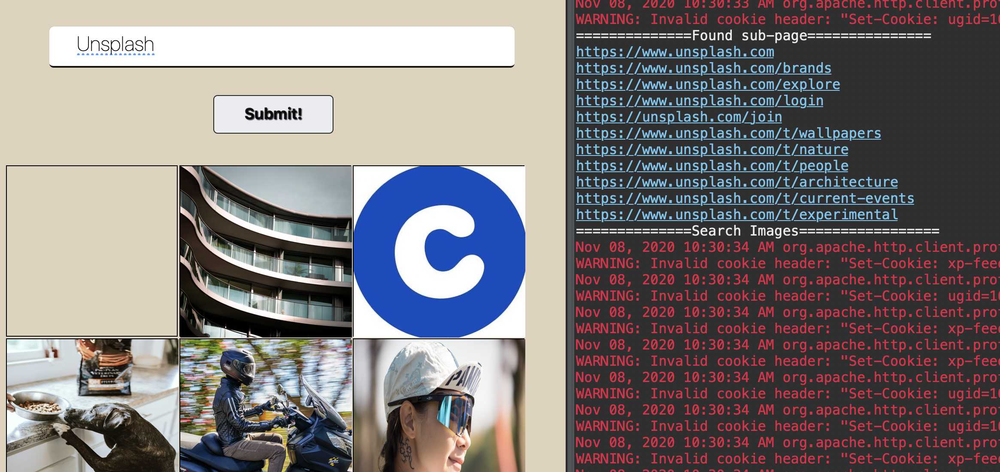
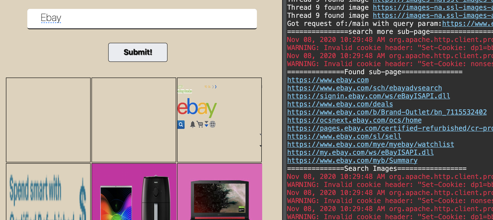

# Web Crawler for Images

## Package

- Serverlet 3.1.0
- Jstl 1.2
- Jsoup 1.11.3
- Http client 4.5.10

## Added Functions

* Allow user to put the url in multiple forms
  * Https://www.xx.com
  * www.xx.com
  * xx.com
  * xx

* Search sub-page from the website content (Maximum 10)
  * Check if given url is valid or not 
  * Get all href links from current page and format all of it
  * Use hashset to make sure that we don't put same link twice

* Search image from all pages
  * Implemented multithread (Thread's amount depend on website's amount
  * Each thread will claim no more than 20 images (for performance)
  * Use CountDownLatch to make sure that we only return images after all threads stop

## Tested 

1. unsplash.com
2. amazon.com
3. Reshot.com
4. Ebay.com
